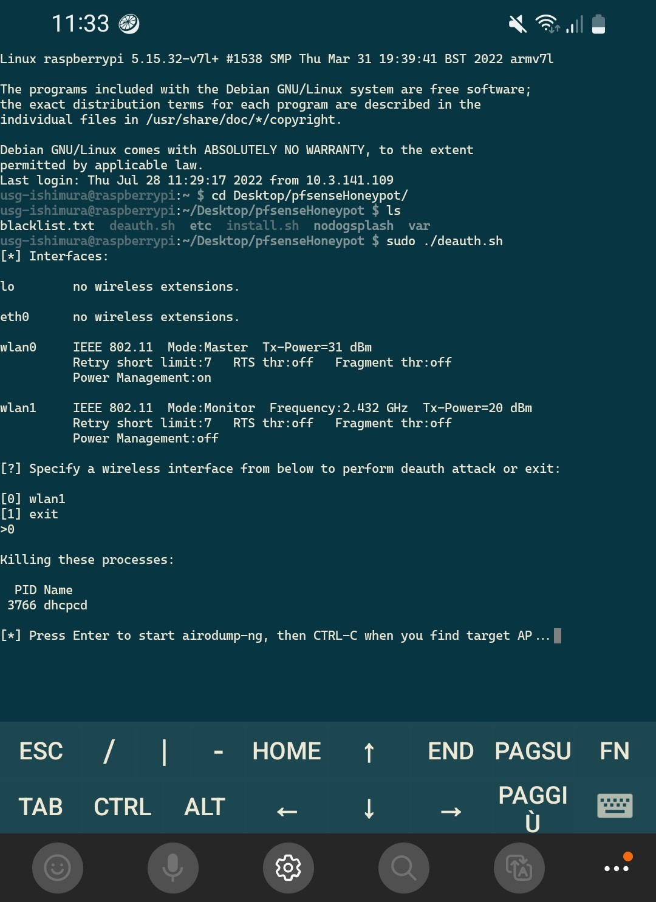
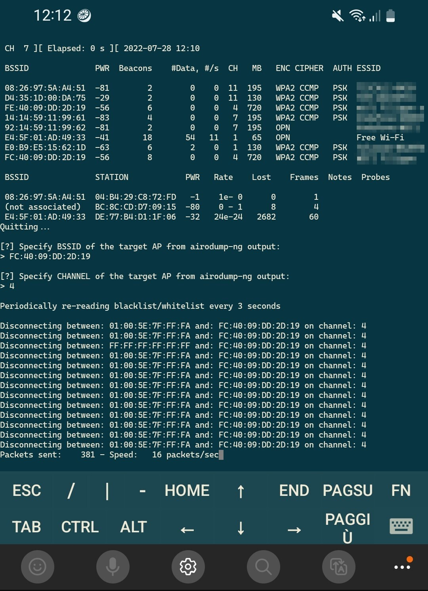
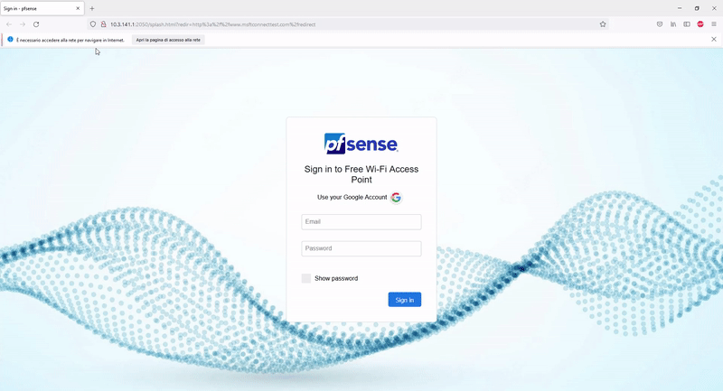
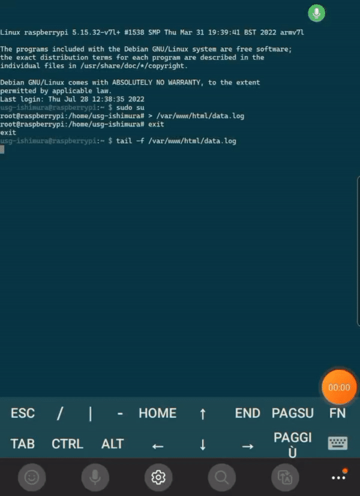

# pfSense Honeypot
### Morning! _Nice day for phishing_ ain't it? :fishing_pole_and_fish:
This project installs RaspAP and Nodogsplash and patches them to run a portable malicious free network, capturing Google credentials and logging DNS queries on Raspberry Pi, it also includes a deauthentication script to disconnect clients from their AP, making them want to connect to the Honeypot.
### Minimum hardware requirements, home setup and no deauth
- Raspberry Pi
- Ethernet connection
- Primary Wireless Network Interface
### Hardware requirements to make it portable
- **Raspberry Pi**, this project is tested on Raspberry Pi 4 Model B
- **Two Wireless Network Interfaces**, the first used for the Access point is integrated in Pi 4 Model B, the secondary can be added via USB to start Monitor Mode and launch Deauth Attack
- **USB-C Ethernet Adapter** and **Ethernet cable**
- Ethernet Tethering capable **Smartphone**
- USB-C **Power Bank**
### Installation
```sh
git clone https://github.com/usg-ishimura/pfsenseHoneypot.git
cd pfsenseHoneypot
sudo ./install.sh
```
### Control Raspberry Pi in the portable setup
In the portable scenario is possible to SSH from Ethernet Tethering device to SSH enabled Raspberry Pi scanning for client local IP on Tethering device Ethernet Interface
#### Portable setup
[<ins>https://www.reddit.com/r/raspberry_pi/comments/pm1kww/psa_you_can_use_android_11s_new_ethernet/</ins>](https://www.reddit.com/r/raspberry_pi/comments/pm1kww/psa_you_can_use_android_11s_new_ethernet/)
### Deauthenticate clients from target AP
Whether you choose to run the Honeypot from home or you make it portable, if you have a secondary Wireless Network Interface you can start Deauth Attack with the following command
```sh
sudo ./deauth.sh
```
Following Screenshots are from Android juiceSSH in the portable scenario, no need to use SSH in home setup,
just Monitor, Keyboard and Mouse can be used to control Raspberry Pi
 

### Victim machine view connecting to the honeypot

### Retrieving credentials
To retrieve credentials from Raspberry Pi you can run
```sh
tail -f /var/www/html/data.log
```

### Sniff DNS traffic
```sh
sudo cat /var/log/dnsmasq.log
```
### Change SSID from CLI
Default SSID is "Free Wi-Fi", edit **/etc/hostapd/hostapd.conf** to change SSID, then
```sh
sudo systemctl restart hostapd.service
```
### Change SSID and other settings from web interface
In home setup you can change RaspAP settings by going to **10.3.141.1:8080** in your browser
- default username: **admin**
- default password: **secret**
